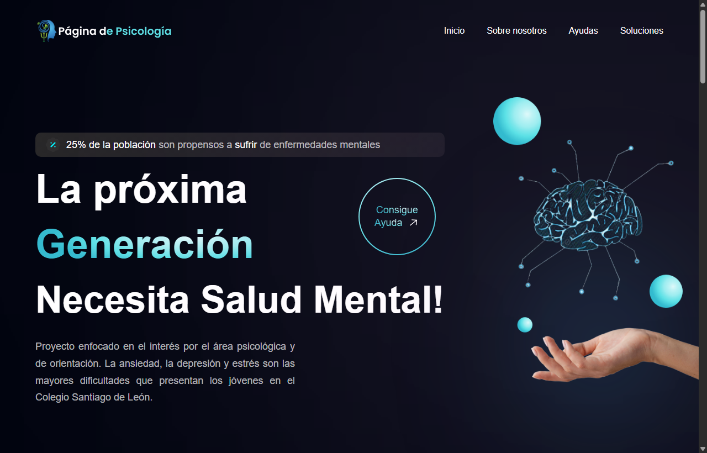
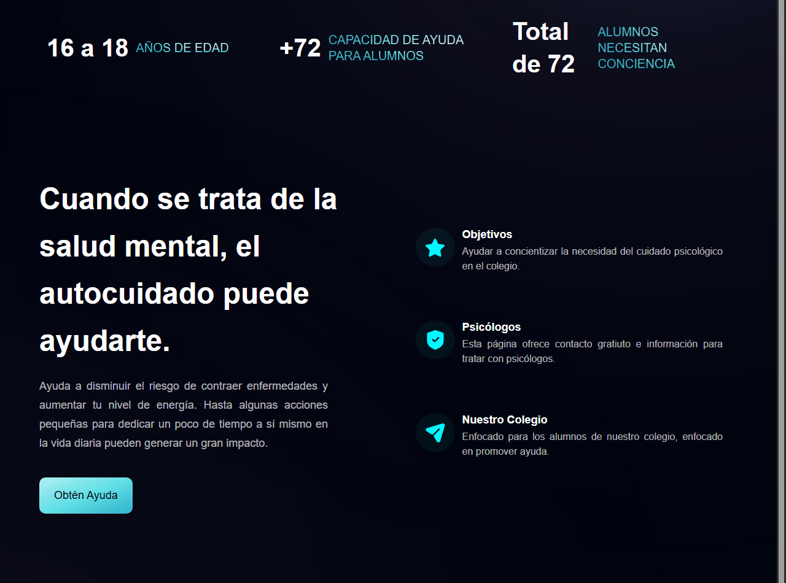
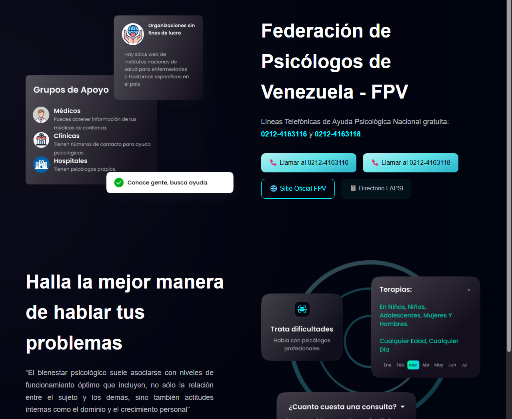

# 🧠 Página de Psicología — Concientización y Orientación Estudiantil

Plataforma web informativa y de orientación psicológica diseñada para sensibilizar sobre la salud mental y facilitar el acceso a recursos y líneas de ayuda profesional para la comunidad estudiantil.

---

## 📌 Contexto del Proyecto

Este sitio web fue desarrollado como parte de un **proyecto de grado para el Colegio Santiago de León de Caracas ([CSLC](https://cslc.edu.ve/))**.

> **Nota sobre el contenido y autoría:**  
> El contenido temático, estadísticas poblacionales, citas especializadas y contactos institucionales (como la Federación de Psicólogos de Venezuela y CECODAP) fueron provistos por la **tesis e investigación del grupo de estudiantes** del proyecto.  
> **Mi rol y aporte:** Diseño de la interfaz (UI/UX), arquitectura de información, maquetación responsiva, desarrollo de componentes interactivos y despliegue del proyecto.

---

## 🛠️ Tecnologías Utilizadas

El proyecto fue construido utilizando un stack frontend moderno, ligero y modular:

- **[React 18](https://react.dev/)**: Biblioteca principal para la arquitectura modular de componentes declarativos (`Navbar`, `Hero`, `Helps`, `Bells`, `Testimonials`, `Footer`).
- **[JavaScript (ES6+) / JSX](https://developer.mozilla.org/es/docs/Web/JavaScript)**: Lógica funcional, manejo de estados con hooks (`useState`) y modularización ESM.
- **[Tailwind CSS](https://tailwindcss.com/)**: Framework utilitario para maquetación, paleta de colores personalizada, degradados dinámicos y diseño responsivo multiplataforma.
- **[Vite](https://vitejs.dev/)**: Entorno de ejecución y empaquetador ultrarrápido con Hot Module Replacement (HMR).
- **PostCSS & Autoprefixer**: Procesamiento y prefijado automático de CSS para compatibilidad entre navegadores.
- **SVG / Vector Graphics**: Iconografía escalable y optimizada para redes sociales y botones de acción.

---

## 📸 Capturas de Pantalla

### 1. Vista Principal (Hero & Concientización)


### 2. Autocuidado y Líneas de Ayuda Nacional (FPV)


### 3. Soluciones, Especialistas y Recursos


---

## 🚀 Instalación y Uso Local

Si deseas clonar y ejecutar este repositorio en tu entorno local:

1. **Clonar el repositorio:**
   ```bash
   git clone https://github.com/Miguel19x/web-psicologia-tesis-santiago.git
   cd psicologia-page
   ```

2. **Instalar dependencias:**
   ```bash
   npm install
   ```

3. **Ejecutar servidor de desarrollo:**
   ```bash
   npm run dev
   ```

4. **Compilar para producción:**
   ```bash
   npm run build
   ```
